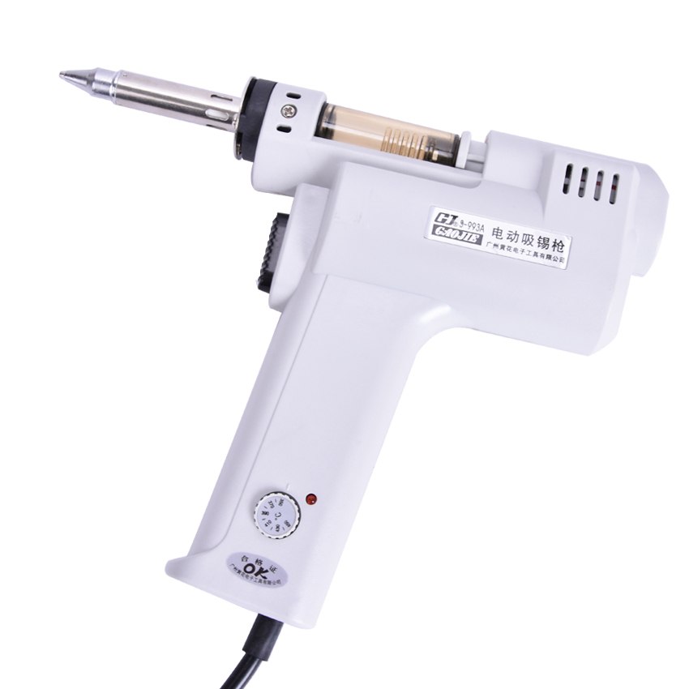

# S-993a desoldering gun control board
Reverse engineering of S-993a/S-995a/S-998p solder sucker control board
 

Control board schematics (made in kicad) of well known S-993a desoldering gun. This board is also used in S-995a, S-998p products.

The board has label "HHCP_J/S-998P.BDAGCCI.V3.1"

Some boards are not populated with most of the motor control components and have only rectifier and D5 diode. Information provided by [Randys Dan](https://www.youtube.com/channel/UCstega9e7F3fUxEAxG64gzQ).

### Schematics ###

### Board photos ###
  

You can notice that my board has fried R8 resistor. Anyway it just works.
